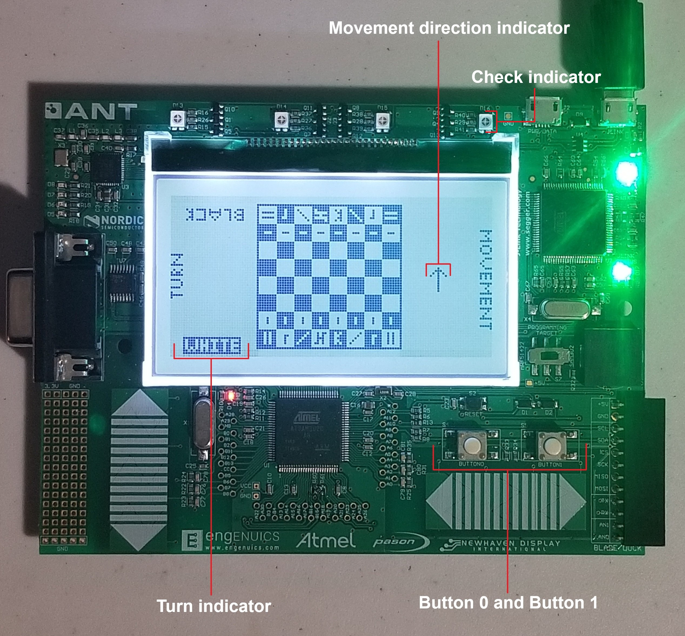
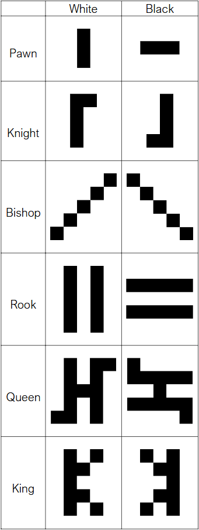

# Checkmate u8
A complete implementation of chess for the MPGL2 Razor Development Board.<br>
Developed as a project submission for the 2024 - 2025 iteration of Jason Long's [Embedded in Embedded](https://embeddedinembedded.com/) program.

## Contents
- [INSTALLATION](#installation)
- [DEVELOPMENT](#development)
- [USAGE](#usage)
  - [Interface](#interface)
  - [Controls](#controls)
  - [Pieces](#pieces)

# Installation
1. Install the necessary tools to compile the project as described in [setup.md](docs/setup.md).
2. Compile the project by opening a new terminal and running the following commands:
    - ``` ./waf configure --board=DOT_MATRIX ``` finds the programs/libraries needed to build. This step should only need to be run once if successful.
    - ``` ./waf build -F ``` builds the project and flashes the device.

# Development
1. Set up the VSCode development environment as described in [vscode.md](docs/vscode.md).
2. Code for the chess application is contained in the following files:
    - [firmware_common/application/chess_app.c](firmware_common/application/chess_app.c)
    - [firmware_common/application/chess_app.h](firmware_common/application/chess_app.h)
    - [firmware_common/application/chess_game.c](firmware_common/application/chess_game.c)
    - [firmware_common/application/chess_lcd.c](firmware_common/application/chess_lcd.c)
    - [firmware_common/application/chess_utils.c](firmware_common/application/chess_utils.c)
    - [firmware_dotmatrix/drivers/lcd_bitmaps.c](firmware_dotmatrix/drivers/lcd_bitmaps.c)
    - [firmware_dotmatrix/drivers/lcd_NHD-C12864LZ.c](firmware_dotmatrix/drivers/lcd_NHD-C12864LZ.c)

# Usage
## Interface


## Controls
### Movement Direction Selection
- Open direction selection menu: **hold button 0 for a half second**
- Cycle through direction options: **button 0**
- Select direction / close direction selection menu: **button 1**

### Making moves
- Move highlighted square: **button 0**
- Selection highlighted square: **button 1**
- Cycle through pawn promotion options: **button 0**
- Select pawn promotion option: **button 1**
- Resign: **hold button 0 for five seconds**

## Pieces

